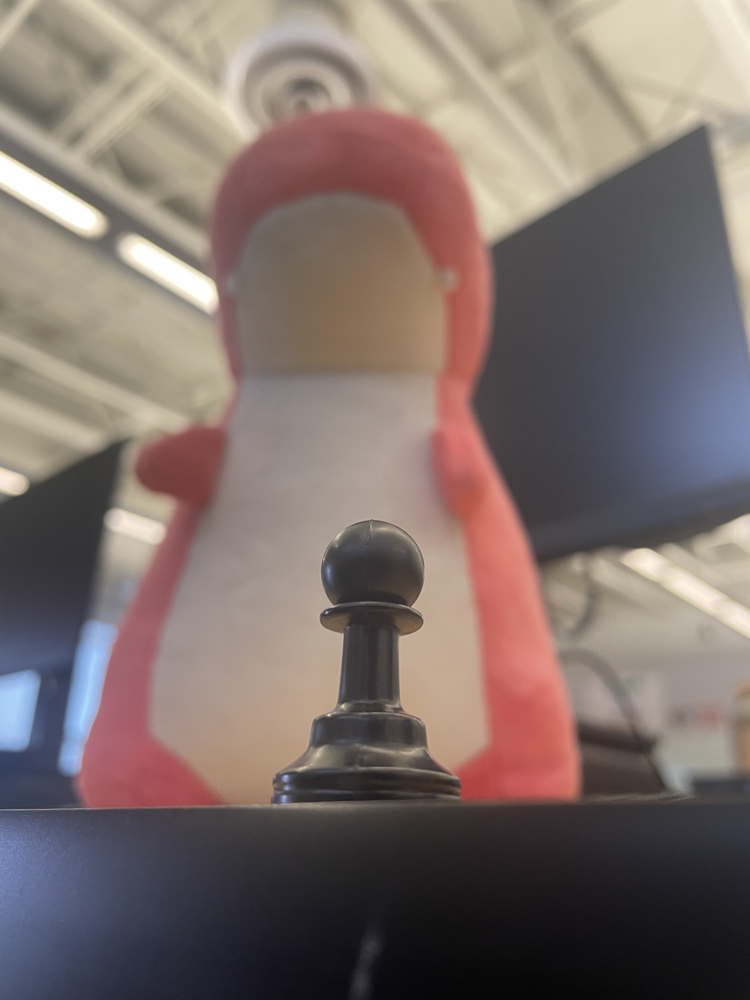
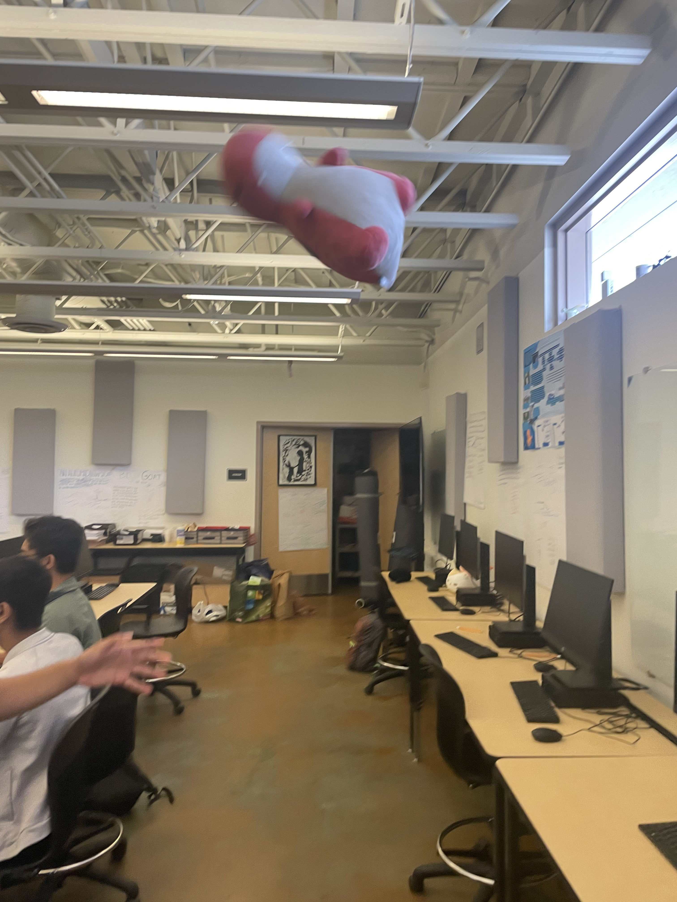
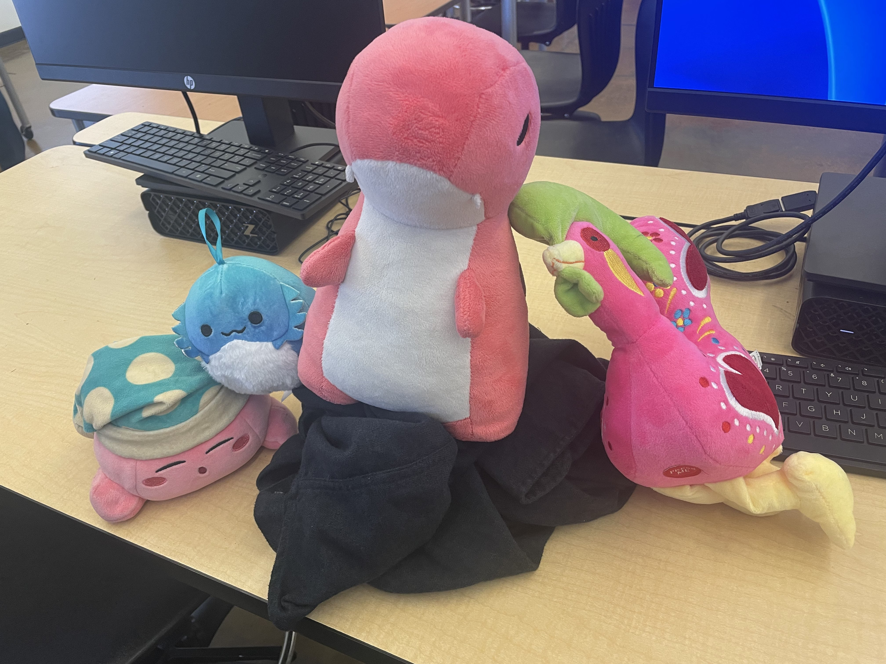

# A One-of-a-Kind Dinosaur Stands Above All
<html>

<head>In-Depth Description on the Lovable Plush</head>

<body style="background:lightpink;">
  <h1> All about Riley Parker Hunter</H1>
    
    <h2> Physical Attributes </h2>
      
Riley Parker Hunter is a pink dinosaur with an angy look on its face. It has brown spots on its back and a white underbelly.They are 10.5 inches tall (26.67 in non-freedom units <em><strong>cough cough</strong></em> cm), 6.13 inches long (15.57 cm) and 6.38 inches wide (16.2 cm) from the base but is 4.38 inches head wide (11.12 cm). They also have stubby little arms like a T-Rex. 

    <h2> Personality </h2>
      
 Riley Parker Hunter is a dynamic being. They are extremely smart and they love adventure. That is clearly seen by how it loves to do wild and dangerous things as shown by the picture below. They are also a leader, though the other plushies all claim that they are a tyrant but nobody knows where that propaganda comes from as all people who visit and see Riley Parker Hunter all can see that they are a well-mannered being who is very polite. 

  

       
  

    <h2> Diet </h2>
      
 Riley Parker Hunter is a being of very picky taste. They will only eat the best of the best slices of cake. Anything else is out of the question. Meat, veggies, grains, those are not it chief. Riley Parker Hunter lives by the motto "If the nourishment is not as sweet as bonbons, then the nourishment is something I will be unable to can eat." Wise words to live by, no health risks involved by entering a pure cake diet.

        
    <h2> History </h2>
      <h3>Past</h3>
        
 According to Eamon Marchant, the owner of Riley Parker Hunter (more about him <a href="https://logant.neocities.org" target="_blank"> here </a> or <a href="https://www.linkedin.com/in/eamon-marchant" target="_blank"> here</a>), Riley Parker Hunter was gifted to him by someone. The gifter is currently of unknown identity but they are somewhere out there in the world. Only Eamon Marchant knows of them but nothing says a little private investigator hiring can't handle this. 

      <h3> Present</h3>
        
 Currently, Riley Parker Hunter sits in top of the 3rd column of Mac A (column 1 is the one closest to the front door of Mac A), the place where Eamon Marchant teaches AP Computer Science as well as AP Physics, and they are adored by all students who lay their eyes upon it. 

 

</body>
</html>
